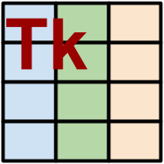

# Python-tkinker

Python uses a GUI library called Tkinter as default. This set of classes allows 
interactive spreadsheet-style tables to be added into an application. Tkinter
is the standard GUI toolkit for python. It is old but still quite popular.
There are various libraries that extend Tkinter functionality, such as Pmw, but there is currently
no extendable table class for Tkinter. A sample application using these classes is included in the distribution.

# This library is also now Python 3 compatible

# Installation

pip install tkintertable or easy_install tkintertable

You can clone the current source using

git clone https://github.com/dmnfarrell/tkintertable.git

# Usage

See the wiki for how to use the table in Python.

# API docs

For programmers, the module documentation is at http://dmnfarrell.github.io/tkintertable/index.html. You are encouraged to subclass the TableCanvas class to add new functionality.
See also

https://github.com/dmnfarrell/pandastable
